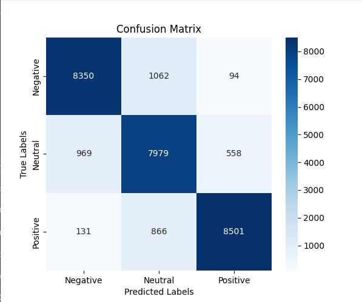
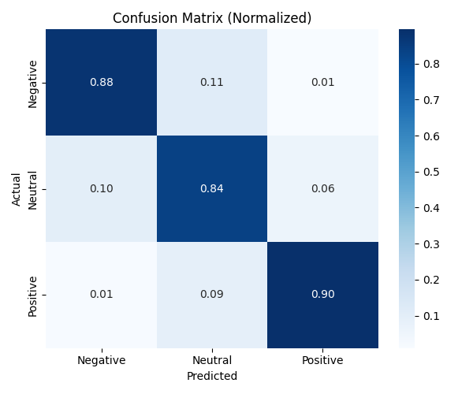

## 📌 Project Philosophy

This project intentionally preserves a controlled amount of real-world noise inside the final training dataset instead of aggressively sanitizing every sample.

The objective was to train the sentiment classifier under realistic social-media conditions, where user-generated content naturally includes:

- repetitive text
- malformed sentences
- slang and informal grammar
- emotionally chaotic writing
- duplicated phrases
- inconsistent punctuation
- low-quality Reddit comments
- partially incoherent text
- noisy conversational patterns

Examples of preserved noise include:

- repeated phrases such as: "Avoid being judgmental."
- incomplete or poorly structured sentences
- emotionally disorganized long-form Reddit posts
- imperfect GPT-generated synthetic samples
- informal internet writing styles

Rather than building a perfectly clean academic benchmark, the pipeline focuses on creating a model capable of handling imperfect real-world inputs commonly found on social media platforms.

The preprocessing pipeline still performs:

- invalid text filtering
- semantic validation
- augmentation quality control
- synthetic sample filtering

but intentionally avoids over-cleaning the dataset in order to preserve natural language variability.

This strategy improves:

- robustness to noisy inputs
- real-world generalization
- inference stability
- tolerance to imperfect user text
- production-oriented behavior

The final model was designed to operate under realistic NLP conditions rather than idealized datasets.

⚠️ Note:
Even though the model achieved strong performance under noisy conditions, cleaner datasets and more aggressive manual curation could likely produce even higher evaluation metrics and better class separation.

For optimal training performance, GPU acceleration is strongly recommended. A GPU with at least **8 GB of VRAM** is suggested for fine-tuning RoBERTa efficiently, especially when using:

- mixed precision training
- gradient accumulation
- SWA optimization
- larger batch sizes
- transformer-based augmentation pipelines


## 🚀 Project Overview

The pipeline consists of the following stages:

1. **Reddit Data Extraction**
2. **Real-Time Streaming with Apache Kafka**
3. **Data Storage with PostgreSQL / MySQL**
4. **Text Cleaning, Data Augmentation & Dataset Balancing**
5. **Fine-Tuning the RoBERTa Sentiment Classifier**
6. **Model Evaluation, Testing & Inference**
7. **Inference API & Web Interface**
8. **Full Docker Support**
9. **Installation & Environment Setup**

## 📥 1. Reddit Data Extraction

- Data is collected from the Reddit API using multiple subreddits grouped into **five categories**.
- The number of posts retrieved is customizable through the `TOTAL_LIMIT` variable.
- The project supports environment-based Reddit authentication using:

  ```env
  REDDIT_CLIENT_ID
  REDDIT_CLIENT_SECRET
  REDDIT_USER_AGENT
  REDDIT_USERNAME
  REDDIT_PASSWORD


## ⚡ 2. Real-Time Streaming with Apache Kafka

The pipeline leverages Apache Kafka to enable real-time data ingestion and processing.
This stage is composed of two main components:

📤 Kafka Producer
- Fetches Reddit posts dynamically using the Reddit API
- Streams each post as a message into a Kafka topic (reddit_posts)
- Controls the ingestion rate to avoid overwhelming the system
- Ensures scalability by decoupling data ingestion from downstream processing

Key responsibilities:

- Data ingestion from Reddit
- Message serialization (JSON)
- Publishing messages to Kafka topics


📥 Kafka Consumer
- Subscribes to the reddit_posts topic
- Consumes messages in batches for efficiency
- Stores raw data into the database (reddit_posts table)
- Applies preprocessing and data augmentation
- Publishes cleaned data into a new Kafka topic (cleaned_data)

Key responsibilities:

- Batch processing of streaming data
- Data persistence (raw + processed)
- Data cleaning and transformation
- Forwarding processed data for downstream tasks


🔄 Streaming Flow
Reddit API → Kafka Producer → Kafka Topic (reddit_posts)
           → Kafka Consumer → Database (raw data)
           → Data Cleaning & Augmentation
           → Kafka Topic (cleaned_data)


⚙️ Kafka Configuration
The pipeline supports both local execution and Docker-based environments.

Kafka broker address
- Use "localhost:9092" for local execution
- Use "kafka:9092" when running with Docker

KAFKA_BROKER=localhost:9092 or kafka:9092

Input topic (raw Reddit data)
KAFKA_TOPIC=reddit_posts

Consumer group identifier (for scalability and fault tolerance)
KAFKA_CONSUMER_GROUP=reddit_consumer_group

Output topic (processed/cleaned data)
TOPIC_OUTPUT=cleaned_data

Consumer group ID (used internally by Kafka)
GROUP_ID=reddit_consumer_group

🧠 Design Considerations
- Decoupled Architecture: Producers and consumers operate independently
- Scalability: Multiple consumers can be added using the same GROUP_ID
- Fault Tolerance: Kafka ensures message durability and replayability
- Batch Processing: Improves performance and reduces database overhead
- Streaming + Processing Hybrid: Combines real-time ingestion with batch transformations

🚀 Why Kafka?
Using Apache Kafka allows this pipeline to:

Handle large-scale data ingestion
Enable real-time sentiment analysis pipelines
Support future extensions (e.g., monitoring, alerting, dashboards)
Integrate easily with distributed systems (Spark, Flink, etc.)


## 🗄️ 3. Data Storage with PostgreSQL / MySQL

The pipeline includes a flexible and scalable storage layer built on top of relational databases such as PostgreSQL and MySQL.
Database interactions are managed using SQLAlchemy, enabling seamless switching between database engines without modifying the core logic.

⚙️ Database Configuration
The system is fully configurable via environment variables:

# Supported values: "postgres" or "mysql"
DB_TYPE=
DB_HOST=
DB_PORT=
DB_NAME=
DB_USER=
DB_PASSWORD=

🔌 Connection Management
A centralized connection handler dynamically builds the database URL
Uses SQLAlchemy engine for efficient connection pooling
Ensures a single reusable connection instance across the pipeline
Supports both local and Docker-based environments

🧱 Data Model Overview
The pipeline stores data across multiple structured tables:

📥 reddit_posts (Raw Data)
Stores original Reddit data ingested from Kafka.
Fields:
- id (Primary Key)
- title
- text
- score
- num_comments
- created_utc
- url
- label (auto-generated)

👉 Labeling Strategy:
Rule-based labeling using subreddit categories
Fallback to sentiment analysis using VADER
Hybrid approach improves labeling robustness

🧹 cleaned_data (Processed Data)
Stores cleaned and normalized text ready for training.
Fields:
- id
- text
- label

🔄 relabeled_data (Hybrid Relabeling)
Stores dataset after applying model-based relabeling
Used to reduce noise and improve data quality before training

Hybrid relabeling uses a pretrained external model
(cardiffnlp/twitter-roberta-base-sentiment)
before the final fine-tuning stage.

⚖️ balanced_* (Balanced Datasets)
Stores class-balanced datasets
Created using undersampling or other balancing strategies

🧪 synthetic_* (Augmented Data)
Stores synthetically generated samples
Used to improve minority class representation

📊 validation_data
Stores validation split (20% of dataset)
Includes text and numeric labels used for evaluation

📈 validation_results
Stores model predictions for validation data
Automatically resets before inserting new results

🧠 Data Processing Logic
- Raw messages from Kafka are stored immediately in reddit_posts
- Data validation filters:
  - Missing fields (id, text)
  - Non-informative text
- Hybrid labeling system:
  - Subreddit-based labeling
  - VADER sentiment fallback
- Cleaned data is stored in cleaned_data
- Additional transformations generate:
  - Relabeled datasets
  - Balanced datasets
  - Synthetic datasets


Kafka (reddit_posts)
        ↓
Database (reddit_posts - raw)
        ↓
Validation + Labeling (Hybrid)
        ↓
Database (cleaned_data)
        ↓
(Others)
   → relabeled_data: 
   → balanced_data:   Balance dataset distribution through oversampling, downsampling or both  
   → combined:   Combine relabeled (raw data) and cleaned data
   → synthetic_data:  Data generated by GPT-2 for oversampling

The dataset used to train the model consists of a mix of balanced and combined data.
Which is called balanced combined


## 🧹 4. Text Cleaning, Data Augmentation & Dataset Balancing

A critical stage of the pipeline focuses on improving data quality, dataset diversity, and class balance before model training.

This step combines:
- Text normalization and preprocessing
- Invalid / noisy text filtering
- Traditional NLP-based data augmentation
- Hybrid dataset balancing using downsampling + oversampling
- Synthetic text generation using GPT-2-based controlled generation

This significantly improves training stability and model generalization.


🧽 Text Cleaning
The clean_text() function standardizes the input text before training.
- Applied preprocessing steps:
- Convert text to lowercase
- Remove special characters
- Remove extra spaces
- Remove emojis and Unicode symbols
- Remove English stopwords using NLTK
- Normalize sentence structure

This helps reduce noise and improves semantic consistency across samples.

🚫 Invalid Text Detection
The is_valid_text() function filters low-quality or meaningless content such as:
- [deleted]
- [removed]
- placeholder text
- extremely short texts
- non-informative content
- malformed generated samples

This prevents noisy samples from contaminating the training dataset.

🔄 Traditional Data Augmentation
To increase dataset diversity, the pipeline applies lightweight augmentation techniques:

🔹 Synonym Replacement
Uses WordNet through NLTK to replace words with semantically similar synonyms.

Example:
Original: I feel very happy today
Augmented: I feel very glad today

🔹 Word Dropout
Randomly removes non-critical words while preserving semantic meaning.
Special care is taken to preserve:

negations (not, never, no)
short but important words

Example:

Original: I do not like this product at all
Augmented: I not like product


🧠 Semantic Validation
Not every augmentation is useful.

The pipeline uses Sentence Transformers (all-MiniLM-L6-v2) to validate semantic similarity between:
- original text
- augmented text
using cosine similarity.

This prevents augmentation from changing the original sentiment meaning.


⚖️ Dataset Balancing Strategy
The original Reddit dataset was highly imbalanced across sentiment classes:
- Positive
- Neutral
- Negative

To prevent model bias toward majority classes, a hybrid balancing strategy was implemented.


🔽 Downsampling (Majority Class)
If severe imbalance is detected:
the majority class is partially reduced
the reduction ratio is automatically adjusted based on imbalance severity
This avoids over-representation without losing too much valuable information.

- Adaptive strategy:
- High imbalance → stronger downsampling
- Moderate imbalance → softer downsampling

This is more robust than fixed-ratio downsampling.


🔼 Oversampling (Minority Classes)
Minority classes are expanded using synthetic text generation with GPT-2.
This improves representation for underrepresented sentiment classes.

The system automatically:
- detects minority classes
- calculates missing samples
- generates only the required amount

This avoids unnecessary synthetic noise.


🧪 Synthetic Data Generation with GPT-2
Instead of naive duplication, the project generates new realistic Reddit-style text samples using:
GPT-2 + prompt-based controlled generation
Each sentiment class uses specialized prompts

Example prompts:
Negative → dissatisfaction / frustration
Neutral → factual, emotion-free statements
Positive → appreciation / satisfaction

Example:
Write a short emotionally positive Reddit comment showing appreciation and satisfaction.

Generation uses:
- nucleus sampling (top_p)
- temperature control
- filtering and validation
- post-cleaning of generated outputs

This produces higher-quality synthetic samples for oversampling.


🧼 Synthetic Data Filtering
Generated samples are additionally filtered using:
- minimum word count
- punctuation checks
- invalid symbol detection
- spam/noise detection
- malformed sentence removal
- prompt leakage removal

This ensures only high-quality synthetic samples are retained.


📊 Preprocessing Metrics
The system tracks preprocessing quality using shared metrics:
- empty_text_count
- invalid_text_count

This helps monitor:
- dataset quality
- cleaning effectiveness
- augmentation quality

and improves debugging across the full pipeline.


🔄 Full Preprocessing Flow
Raw Reddit Data
      ↓
Text Cleaning
      ↓
Invalid Text Filtering
      ↓
Traditional Augmentation
   → synonym replacement
   → word dropout
      ↓
Dataset Balancing
   → downsampling
   → oversampling (GPT-2)
      ↓
Synthetic Data Validation
      ↓
Final Training Dataset


🚀 Why This Matters
This stage improves:
- Model generalization
- Class balance
- Training stability
- Minority class performance
- Label quality
- Real-world robustness

Without this step, the model would suffer from:
- overfitting
- class bias
- poor minority recall
- noisy training signals


## 🤖 5. Fine-Tuning the RoBERTa Sentiment Classifier

The training stage focuses on fine-tuning RoBERTa for multi-class sentiment classification:
- Negative
- Neutral
- Positive

The model is trained using a production-oriented strategy designed to improve:
- generalization
- minority class performance
- training stability
- robustness against overfitting

This goes far beyond standard fine-tuning.

🧠 Model Architecture
The project uses:
roberta-base

via Hugging Face Transformers.

Configuration includes:
- num_labels = 3
- reduced dropout tuning
- attention dropout optimization
- progressive layer unfreezing
- mixed precision training
- SWA optimization

This setup improves performance while maintaining efficient training.

📦 Flexible Dataset Selection
Training supports multiple dataset sources:

Available sources:
- raw → original Reddit data
- relabeled → hybrid relabeled dataset
- cleaned → cleaned + augmented dataset
- combined → 50% relabeled + 50% cleaned

Available training modes:
- unbalanced
- balanced
- synthetic

This allows controlled experimentation and comparison between data strategies.

Example:
train_model(
    data_source="combined",
    dataset_type="balanced"
)


⚖️ Loss Function Strategy
Because sentiment classes remain naturally imbalanced, the training pipeline uses advanced loss handling.

🔥 Focal Loss (Primary)
Custom Focal Loss is used to improve minority class learning.

Benefits:
- reduces dominance of easy samples
- focuses on hard examples
- improves minority recall
- reduces majority class bias

Additional improvements:
- dynamic alpha calculation
- class-aware weighting
- special boost for the Neutral class
This significantly improved F1 performance.


🔹 Weighted CrossEntropy (Alternative)
Also implemented as a fallback baseline using:
- class weights
- balanced label distribution
This allows direct comparison against Focal Loss.


🧊 Progressive Layer Freezing / Unfreezing
Instead of fine-tuning the full model immediately
Initial strategy:
- first 6 RoBERTa layers are frozen
Progressive unfreezing:
- deeper layers are gradually unfrozen every few epochs

Benefits:

- prevents catastrophic forgetting
- stabilizes early training
- improves transfer learning efficiency
- reduces overfitting risk

This behaves similarly to advanced techniques like Layer-wise Learning Rate Decay (LLRD).


📈 Learning Rate Optimization
The project uses:
OneCycleLR Scheduler
instead of static learning rates.

This provides:

- warm-up phase
- cosine annealing
- smoother convergence
- better final generalization

Additional learning rate reductions are applied when new layers are unfrozen.


⚡ Mixed Precision + Gradient Accumulation
Training includes:
- Mixed Precision Training

Using:
- autocast + GradScaler

Benefits:

- lower VRAM consumption
- faster training
- improved GPU efficiency

Gradient Accumulation

Configuration:
- batch_size = 24
- accumulation_steps = 3

This simulates larger effective batch sizes without GPU memory issues.


🧠 Stochastic Weight Averaging (SWA)
The final training epochs use:
SWA (Stochastic Weight Averaging)

This technique:
- averages model weights
- improves generalization
- produces flatter minima
- reduces validation instability

The final saved model is the SWA-optimized version, not the raw last epoch checkpoint.


🛑 Early Stopping
To avoid overfitting:

Early stopping monitors:
- weighted F1-score
- validation loss

Training stops automatically if no improvement is detected.
This prevents unnecessary training and preserves the best-performing checkpoint.


📊 Validation Strategy
Dataset split:
- 80% Training
- 20% Validation
using stratified sampling.

Validation data is also stored in the database for:
- reproducibility
- inference testing
- model evaluation consistency


📈 Evaluation Metrics
Each epoch tracks:

- Validation Accuracy
- Weighted F1 Score
- Training Loss
- Validation Loss
- Full Classification Report

Special focus is placed on:
Weighted F1 Score
because it better reflects performance on imbalanced datasets.


💾 Model Saving
The final model is saved as:
Roberta_sentiment_model/

including:

- model weights (model.safetensors)
- tokenizer
- config files
- tokenizer metadata

This allows immediate deployment with:
- AutoTokenizer.from_pretrained(...)
- AutoModelForSequenceClassification.from_pretrained(...)
and direct upload to Hugging Face.


🔄 Training Flow
Balanced Dataset
      ↓
Train / Validation Split
      ↓
RoBERTa Tokenization
      ↓
Progressive Fine-Tuning
   → Focal Loss
   → OneCycleLR
   → Mixed Precision
   → SWA
   → Early Stopping
      ↓
Validation Monitoring
      ↓
Best Model Selection
      ↓
Final SWA Model Saved


This is a production-grade training strategy for robust NLP classification
with:

- advanced optimization
- imbalance handling
- model stability improvements
- reproducible experimentation
- deployable output


## 🧪 6. Model Evaluation, Testing & Inference

After training, the fine-tuned RoBERTa model is evaluated using a dedicated validation pipeline designed to measure both global performance and per-class robustness.
This stage ensures the model is reliable before deployment and provides detailed diagnostics for sentiment classification quality.

📦 Validation Dataset
The validation dataset is automatically created during training using an 80/20 stratified split:
- 80% → Training set
- 20% → Validation set

The validation split is stored in the database inside:
validation_data
Fields:
- id
- text
- label

This guarantees reproducibility and allows evaluation to be performed independently after training.


🤖 Inference on Validation Data
The saved model from Roberta_sentiment_model is loaded for evaluation.

Each validation sample is processed using:
- RoBERTaTokenizer
- RoBERTaForSequenceClassification
- Softmax probability scoring
- Argmax class prediction

Predicted labels are then stored in:
validation_results
Fields:
- id
- text
- predicted_label

This separation between ground truth and predictions enables robust post-training analysis.


📊 Evaluation Metrics
The project uses multiple evaluation metrics to avoid relying only on accuracy.

- Global Metrics
- Accuracy
- Weighted F1-score
- Balanced Accuracy
- Matthews Correlation Coefficient (MCC)

These metrics provide a better understanding of performance, especially under class imbalance.


🔍 Per-Class Detailed Metrics
For each sentiment class:
- Negative
- Neutral
- Positive

the system computes:
- TP (True Positives)
- TN (True Negatives)
- FP (False Positives)
- FN (False Negatives)
- Precision
- Recall
- F1-score
- Balanced Accuracy
- MCC
- Support

This helps identify which classes are harder to predict (typically the Neutral class).


📈 Confusion Matrix Analysis
Two confusion matrices are generated:

- Standard Confusion Matrix
Shows absolute prediction counts across classes.

<p align="center">
  
</p>

- Normalized Confusion Matrix
Shows percentage-based performance for easier interpretation.

<p align="center">
  
</p>

These visualizations help detect systematic classification errors and class confusion patterns.


🧾 Final Evaluation Results
Final model performance achieved:

- Accuracy: 0.8709
- F1-score: 0.8715

| Class    | Precision | Recall | F1-Score | Balanced Acc. |   MCC |
| -------- | --------: | -----: | -------: | ------------: | ----: |
| Negative |     0.884 |  0.878 |    0.881 |         0.910 | 0.822 |
| Neutral  |     0.805 |  0.839 |    0.822 |         0.869 | 0.731 |
| Positive |     0.929 |  0.895 |    0.912 |         0.930 | 0.869 |

Key Observations
- Positive sentiment achieved the strongest performance
- Neutral sentiment remained the most challenging class
- Balanced Accuracy confirms strong generalization across classes
- MCC indicates strong classification reliability beyond simple accuracy
- Class balancing + hybrid relabeling + Focal Loss significantly improved minority class performance


🔍 Manual Prediction Mode
The project also includes an interactive testing mode:
manual_prediction()
This allows users to input custom text and receive real-time sentiment predictions directly from the trained model.

Example:
Input: "I really enjoyed using this app today"
Prediction: Positive

This is useful for:

- quick qualitative testing
- manual verification
- demo purposes
- API validation before deployment


🔄 Evaluation Flow
Training
   ↓
Validation Split Saved
   ↓
validation_data
   ↓
Model Inference
   ↓
validation_results
   ↓
Metrics + Confusion Matrix + MCC + F1
   ↓
Manual Testing


🎯 Why This Evaluation Strategy?
This evaluation design ensures:
- reliable offline validation
- reproducible testing
- strong interpretability
- production readiness
- detection of weak classes before deployment

Rather than using only accuracy, the project focuses on robust real-world performance validation for sentiment analysis systems.


## 🌐 7. Inference API & Web Interface

To make the trained model easily accessible and testable, the project includes a production-ready REST API built with FastAPI, along with a lightweight web interface developed using HTML, CSS, and JavaScript.

This allows both programmatic access and interactive testing of the sentiment analysis model.

🚀 API Features
- Real-time sentiment prediction
- Automatic language detection
- On-the-fly translation to English
- Probability distribution output
- Clean JSON responses
- Interactive browser-based UI

🌍 Multilingual Support
The API supports multilingual input using:
- langdetect for language detection
- Helsinki-NLP/opus-mt-xx-en translation

🔄 Flow:
User Input (any language)
→ Language Detection
→ (If not English) Translation to English
→ RoBERTa Inference
→ Sentiment Output

🌍 Multilingual Support
The API supports multilingual sentiment analysis through automatic language detection and dynamic translation to English before inference.

Currently supported languages:
| Language | Code | Translation Model            |
| -------- | ---- | ---------------------------- |
| English  | `en` | No translation required      |
| Spanish  | `es` | `Helsinki-NLP/opus-mt-es-en` |
| French   | `fr` | `Helsinki-NLP/opus-mt-fr-en` |
| German   | `de` | `Helsinki-NLP/opus-mt-de-en` |
| Italian  | `it` | `Helsinki-NLP/opus-mt-it-en` |


The API uses:
langdetect for automatic language identification
MarianMT translation models from Helsinki-NLP
Dynamic model loading with in-memory caching for improved performance

🔄 Multilingual Inference Flow
User Input
→ Language Detection
→ Dynamic Translation Model Selection
→ Translation to English (if required)
→ RoBERTa Sentiment Inference
→ Sentiment Prediction

This allows the RoBERTa model (trained in English) to perform sentiment analysis on multiple languages without retraining the classifier.


⚡ Dynamic Translation Model Loading

Translation models are loaded dynamically only when required.
Benefits:

- lower initial API startup time
- reduced memory usage
- scalable multilingual support
- cached translation models for faster repeated inference

Once a language model is loaded, it remains cached in memory and is reused for future requests.

🧠 Model Inference

The API loads the fine-tuned model from:
Roberta_sentiment_model/
and performs:

- Tokenization with RobertaTokenizer
- Inference with RobertaForSequenceClassification
- Softmax probability calculation
- Argmax classification

📡 API Endpoints
- POST /predict

Performs sentiment analysis on input text.
Request:
{
  "text": "I really like this product!"
}
Response:
{
  "input": "I really like this product!",
  "prediction": {
    "original_text": "I really like this product!",
    "processed_text": "I really like this product!",
    "label_index": 2,
    "label": "Positive",
    "probabilities": {
      "Negative": 0.01,
      "Neutral": 0.05,
      "Positive": 0.94
    }
  }
}


- GET /form

Provides a web-based interface for testing the model.


🖥️ Web Interface (Frontend)

A simple UI is included to interact with the API directly from the browser.

Features:
- Text input box
- Submit button
- Real-time prediction display
- Clean and responsive design

Tech Stack:
- HTML
- CSS
- JavaScript (Fetch API)

📂 Project Structure (API)
fastapi_app/
   └── inference_api.py
templates/
   └── index.html
static/
   ├── styles.css
   └── script.js

▶️ Running the API
Locally:
python inference_api.py

or using Uvicorn:
uvicorn inference_api:app --host 0.0.0.0 --port 8000 --reload

🌐 Access Points

Web Interface:
http://localhost:8000/form

Docs (Swagger UI):
http://localhost:8000/docs


🧪 Example Use Cases
- Manual sentiment testing
- Demo for stakeholders
- API integration in other services
- Validation before deploying to production
- Multilingual sentiment analysis


🎯 Why This API Matters

This component transforms the project from:

👉 just a trained model into a deployable, interactive AI service

It enables:

- real-time usage
- easy testing
- frontend integration
- production deployment readiness


## 🐳 8. Full Docker Support

The project includes a fully containerized architecture designed for:

- reproducible environments
- simplified deployment
- scalable orchestration
- isolated services
- production-ready inference
- GPU-compatible model training

The platform provides two independent Docker images:

1. Full ML Pipeline Image
2. Inference API Image

DockerHub Repository:
https://hub.docker.com/repositories/cesarwkr 

This separation allows training and inference to scale independently.

🧠 Dockerized Architecture
The ecosystem is orchestrated using Docker Compose and includes:

- Apache Kafka
- Zookeeper
- PostgreSQL
- FastAPI Inference API
- Unified ML Pipeline
- Optional pgAdmin (development profile)

📦 Docker Images

| Image                       | Purpose                        |
| --------------------------  | --------------------------     |
| `sentiment_pipeline`        | End-to-end ML pipeline         |
| `sentiment_inference_api`   | Real-time inference API        |

🧱 Full Pipeline Container
The pipeline container executes the entire workflow through:
main.py

This includes:

- Reddit data extraction
- Kafka streaming
- Data ingestion
- Cleaning & preprocessing
- Hybrid relabeling
- Dataset balancing
- GPT-2 synthetic generation
- RoBERTa fine-tuning
- Validation & evaluation
- Manual testing

🔄 Pipeline Flow
Reddit API
→ Kafka Producer
→ Kafka Consumer
→ PostgreSQL
→ Cleaning & Augmentation
→ Hybrid Relabeling
→ Dataset Balancing
→ RoBERTa Training
→ Validation & Metrics
→ Final Model Export

⚙️ Main Pipeline Orchestration
The pipeline automatically coordinates:

- Kafka consumer threading
- asynchronous ingestion
- database synchronization
- training execution
- evaluation workflows

Key orchestration features:

- automatic waiting for processed data availability
- timeout protection
- validation-data persistence
- automatic model reuse if already trained
- GPU acceleration support
- mixed precision compatibility


🌐 Inference API Container
A separate lightweight container is used for inference and deployment.
The API container includes:

- FastAPI
- multilingual translation support
- HTML/CSS/JS frontend
- Swagger documentation
- real-time sentiment inference

The inference service loads:
Roberta_sentiment_model/

and exposes:
- REST endpoints
- browser testing interface
- multilingual prediction support


🐋 Multi-Stage Docker Builds
Both Dockerfiles use multi-stage builds to optimize:
- image size
- dependency reuse
- build speed
- security

✅ Key Optimizations
- layered dependency caching
- reduced final image size
- isolated runtime environment
- removal of unnecessary build tools
- minimized attack surface


🔒 Security Best Practices
The Docker setup follows several container security recommendations.

- Implemented Measures
- non-root execution (appuser)
- isolated runtime containers
- minimized base images
- dependency separation
- reduced privilege escalation risks
- environment-variable based configuration

Example:
RUN useradd --create-home --uid 1000 appuser
USER appuser

This prevents running services as root inside containers.

⚡ GPU Support
The training pipeline supports GPU acceleration using CUDA-enabled PyTorch images.

- Supported Features
- CUDA 12.4
- Mixed Precision Training
- SWA optimization
- Large transformer fine-tuning

Docker Compose GPU reservation:

deploy:
  resources:
    reservations:
      devices:
        - capabilities: [gpu]

This enables accelerated RoBERTa training when NVIDIA Docker runtime is available.


🧩 Docker Compose Architecture
The full platform is orchestrated through:
docker-compose.yml

Included Services
| Service         | Description                |
| --------------- | -------------------------- |
| `zookeeper`     | Kafka coordination         |
| `kafka`         | Real-time streaming        |
| `postgres`      | Persistent storage         |
| `pipeline`      | Unified ML workflow        |
| `inference_api` | Real-time predictions      |
| `pgadmin`       | Optional DB administration |


🧪 Development Profiles
Docker Compose supports optional profiles for flexible execution.
Development Profile

Enables:

pgAdmin
- live development workflows
- local debugging
- GPU Profile

Enables:

- GPU access
- accelerated transformer training

Example:
docker compose --profile gpu up


📂 Persistent Volumes
Named Docker volumes are used for persistence:
volumes:
  postgres_data:
  pgadmin_data:

This preserves:
- database data
- pgAdmin configuration
- training metadata
across container restarts.


🚀 Running the Platform
Start Infrastructure + Services:
docker compose up

Start with GPU Support:
docker compose --profile gpu up

Start Development Environment:
docker compose --profile dev up


🧠 Inference API Access
Once running Web Interface
http://localhost:8000/form

Swagger Documentation
http://localhost:8000/docs

Run Container:
docker run -p 8000:8000 cesarwkr/sentiment_inference_api:latest


🛠️ Makefile Automation
The project includes a production-oriented Makefile to simplify Docker workflows.

Supported Commands
| Command        | Description               |
| -------------- | ------------------------- |
| `make build`   | Build all images          |
| `make up`      | Start services            |
| `make down`    | Stop services             |
| `make publish` | Build + tag + push images |
| `make clean`   | Remove local images       |


🔑 DockerHub Authentication
The Makefile supports secure authentication using environment variables:
DOCKER_USERNAME=
DOCKER_PASSWORD=

📦 Docker Image Publishing
The project supports automated DockerHub publishing.

Publish Workflow:
make publish

This automatically performs:
- image build
- tagging
- DockerHub push

🤖 GitHub Actions CI/CD
A GitHub Actions workflow automates image publishing on every push to:
main

Automated Steps
- repository checkout
- DockerHub login
- Buildx setup
- pipeline image build
- inference API image build
- automatic DockerHub push

Workflow file:
.github/workflows/docker_publish.yml

⚡ Docker Slim Optimization
The inference API image supports additional optimization using:
Docker Slim

Benefits:
- reduced image size
- faster deployment
- lower attack surface
- improved startup speed

Example:
make slim


🎯 Why This Docker Architecture Matters
This Docker strategy transforms the project into a:

- portable ML platform
- production-ready NLP service
- scalable streaming architecture
- reproducible research environment
- deployable AI inference system

It enables:

- local development
- cloud deployment
- CI/CD integration
- GPU training
- scalable inference
- isolated environments


## 9. ⚙️ Installation & Environment Setup
Before running the project locally, install the required Python dependencies.

1️⃣ Clone the Repository
2️⃣ Create a Virtual Environment (Recommended)
3️⃣ Install PyTorch with CUDA Support
This project was developed using:
- Python 3.12.3
- PyTorch 2.6.0
- CUDA 12.4

Install the CUDA-enabled version of PyTorch:
pip install torch torchvision torchaudio --index-url https://download.pytorch.org/whl/cu124

Optional fixed version:
pip install torch==2.6.0 --index-url https://download.pytorch.org/whl/cu124

This enables GPU acceleration for:
- RoBERTa fine-tuning
- mixed precision training
- SWA optimization
- transformer inference

4️⃣ Install Project Requirements
pip install -r requirements.txt

For the FastAPI inference service separately:
pip install -r fastapi_app/requirements.txt

5️⃣ Configure Environment Variables
Create a .env file in the root directory and configure:
REDDIT_CLIENT_ID=
REDDIT_CLIENT_SECRET=
REDDIT_USER_AGENT=
REDDIT_USERNAME=
REDDIT_PASSWORD=

DB_TYPE=
DB_HOST=
DB_PORT=
DB_NAME=
DB_USER=
DB_PASSWORD=

KAFKA_BROKER=
KAFKA_TOPIC=


✅ Environment Ready
After installation, the project is ready for:
- local training
- Kafka streaming
- FastAPI inference
- Docker execution
- GPU acceleration
- model evaluation


📁 Additional Resources
The repository also includes exported datasets and a standalone training notebook for experimentation and reproducibility.

📊 Exported Datasets
All datasets used throughout the pipeline are available in the root directory inside:
Datasets/

These datasets were exported from the database into CSV format and can be used for:
- offline experimentation
- reproducible training
- model benchmarking
- data analysis
- visualization
- custom preprocessing workflows

The folder may contain datasets such as:
- reddit posts
- cleaned data
- relabeled data
- balanced combined
- validation data
- validation results

This allows users to explore the project without necessarily running the full Kafka pipeline.

📓 Standalone Training Notebook
The project also includes a Jupyter Notebook dedicated exclusively to model training.
Location:
just_train_model/train_roberta_sentiment.ipynb

This notebook provides a simplified workflow for:
- loading datasets directly from CSV files
- preprocessing text
- tokenization
- RoBERTa fine-tuning
- evaluation
- experimentation with hyperparameters

It is useful for:
- quick experimentation
- educational purposes
- testing training strategies
- debugging model behavior
- running training independently from the full streaming pipeline

The notebook allows users to train the sentiment classifier without needing to execute:
- Kafka
- Docker Compose
- the complete production pipeline

making experimentation significantly faster and easier.

🌍 Kaggle Resources
The project also provides public Kaggle resources containing:
- the final balanced dataset used for training
- model evaluation workflows
- inference testing
- confusion matrix analysis
- performance metrics

These resources allow users to explore and validate the trained model without running the full pipeline locally.

📓 Kaggle Notebook (Model Testing & Evaluation)
A public Kaggle notebook is available for loading and testing the trained RoBERTa model

The notebook includes:

- loading the tokenizer
- loading model safetensors
- sentiment inference
- validation testing
- confusion matrix generation
- evaluation metrics
- prediction analysis

⚠️ Note:
The Kaggle notebook is focused on inference and evaluation only.
Model training is not performed inside the notebook.

📊 Kaggle Dataset
The balanced dataset used to train the final model is also publicly available
This dataset corresponds to the balanced combined dataset used during RoBERTa fine-tuning.
The dataset includes:

- cleaned Reddit text
- multiclass sentiment labels
- balanced class distributions
- training-ready samples

This allows users to:

- reproduce evaluation workflows
- test alternative models
- benchmark NLP architectures
- perform independent experimentation
- validate inference performance without rebuilding the entire pipeline

Dataset in kagle:
https://www.kaggle.com/datasets/cesarwk/balanced-multiclass-sentiment-dataset-from-reddit/settings 

Notebook in Kagle:
https://www.kaggle.com/code/cesarwk/roberta-sentiment-model 


🤗 Hugging Face Model Hub
The trained RoBERTa model is publicly available on Hugging Face

from transformers import RobertaTokenizer, RobertaForSequenceClassification

MODEL_NAME = "SkyNet-DL/sentiment-roberta"

tokenizer = RobertaTokenizer.from_pretrained(MODEL_NAME)
model = RobertaForSequenceClassification.from_pretrained(MODEL_NAME)

Since the uploaded config.json currently contains generic labels (LABEL_0, LABEL_1, LABEL_2), sentiment labels can be manually mapped inside the inference code without needing to retrain or re-upload the model.

Example:

from transformers import RobertaTokenizer, RobertaForSequenceClassification
import torch
import torch.nn.functional as F

MODEL_NAME = "SkyNet-DL/sentiment-roberta"

# Load model from Hugging Face
tokenizer = RobertaTokenizer.from_pretrained(MODEL_NAME)
model = RobertaForSequenceClassification.from_pretrained(MODEL_NAME)

# Manual label mapping
LABELS = {
    0: "Negative",
    1: "Neutral",
    2: "Positive"
}

text = "I really enjoyed this product!"

inputs = tokenizer(text, return_tensors="pt", truncation=True)

with torch.no_grad():
    outputs = model(**inputs)
    probs = F.softmax(outputs.logits, dim=1)
    pred = torch.argmax(probs, dim=1).item()

print("Prediction:", LABELS[pred])

This approach allows the model to remain fully usable directly from Hugging Face even if the original config.json does not yet contain human-readable labels.

This allows:
- direct model download
- lightweight deployments
- easier inference integration
- simplified Docker images
- cloud-based model distribution

The model repository includes:
- model.safetensors
- tokenizer files
- config files
- vocabulary files

making the model fully compatible with Hugging Face Transformers.

Hugging face link: https://huggingface.co/SkyNet-DL/sentiment-roberta 


## 🎥 YouTube API Demo
A full video demonstration of the Sentiment Analysis API is also available on YouTube.

The video showcases:

- How to launch the FastAPI inference service
- How to use the web interface
- Real-time sentiment prediction testing
- Multilingual text inference
- API response behavior
- End-to-end model interaction

📺 Watch the demo here:

https://www.youtube.com/watch?v=ExuS0F8i0Wo

This demo provides a quick overview of how the deployed inference system works in practice.